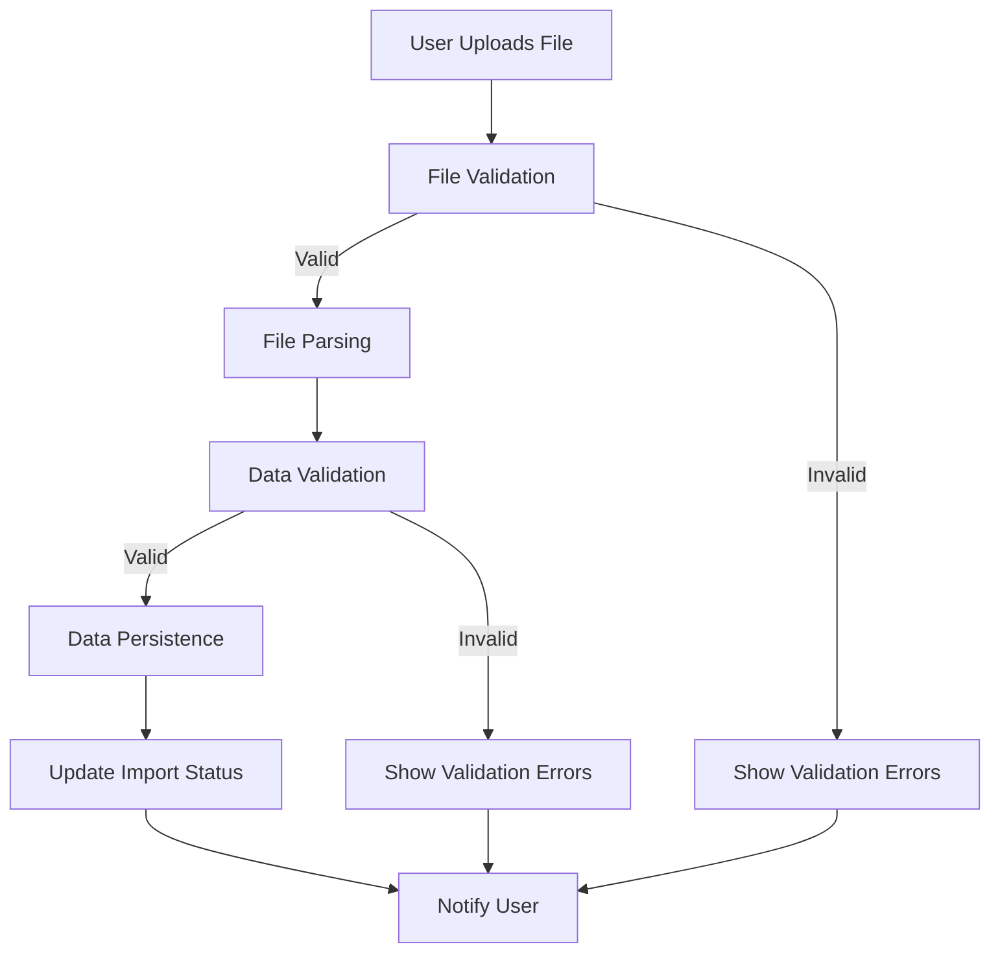

# Import Flow Documentation

## Overview
This document describes the import process flow in MK9 Analytics, from file upload to data persistence.

## Overview Diagram

## Detailed Steps

### 1. File Upload
- User accesses `/dashboard/imports` page
- User drags and drops or selects file (.xlsx, .xls, .csv)
- System validates:
  - File extension
  - MIME type
  - File size (max 10MB)
  - Virus scan (placeholder for future integration)

### 2. File Processing
Upon successful validation:
- File is stored temporarily
- Import record created with `PENDING` status
- ImportFile record created with metadata (filename, hash)
- File content is parsed based on format:
  - Excel (.xlsx, .xls): Using `xlsx` library
  - CSV: Using `papaparse` library
- Automatic delimiter detection for CSV (comma, semicolon, tab)
- For Excel files, user selects which sheet to import
- Preview of first 10 rows shown for validation

### 3. Data Validation
Parsed data is validated against expected schema:
- Required columns present
- Data types correct (dates, numbers, text)
- Referential integrity (foreign keys exist)
- Business rules (e.g., visit dates within operation period)
- Duplicate detection (based on file hash and content)

### 4. Data Persistence
Validated data is persisted to database:
- Import status updated to `PROCESSING`
- Data mapped to domain entities:
  - Visits
  - Promoters
  - Stores
  - Industries
  - Operations
- Relationships established
- Audit timestamps set
- Import status updated to `SUCCESS` or `FAILED`

### 5. Post-Processing
- Temporary files cleaned up
- SyncLog entries created for audit
- User notified of success or failure
- Dashboard data updated (if applicable)
- Webhooks triggered (if configured)

## Error Handling
- File validation errors: User sees specific field errors
- Parsing errors: Detailed error with line number if applicable
- Validation errors: List of rows with errors, downloadable CSV
- Persistence errors: Transaction rolled back, error logged
- System errors: Generic error message, detailed log for administrators

## Validation Rules
### Visit Import
Required columns:
- promoter_name
- store_code
- industry_code
- scheduled_date
- status (PLANEJADA, REALIZADA, CANCELADA)

Optional columns:
- completed_date
- notes

Validation rules:
- promoter_name must exist in promoter table (exact match)
- store_code must exist in store table
- industry_code must exist in industry table
- scheduled_date must be valid date
- status must be valid VisitStatus enum
- If status is REALIZADA, completed_date must be provided and >= scheduled_date
- If status is CANCELADA, completed_date must be null
- If status is PLANEJADA, completed_date must be null

### Promoter Import
Required columns:
- name
- supervisor_email (optional if supervisor_name provided)
- supervisor_name (optional if supervisor_email provided)
- city (optional)
- state (optional)

Validation rules:
- At least one of supervisor_email or supervisor_name must be provided
- If supervisor_email provided, must match existing supervisor email
- If supervisor_name provided, must match existing supervisor name
- city and state optional but if provided must be strings

## File Hashing
- SHA-256 hash of file content generated
- Used for duplicate detection
- Prevents re-importing identical files
- Stored in ImportFile.fileHash field

## Batch Processing
- Files processed in batches of 100 records
- Progress reported to user via websocket/polling
- Ability to cancel long-running imports
- Retry mechanism for transient failures

## Performance Considerations
- Streaming parsing for large files
- Database transactions per batch
- Index optimization for lookup tables
- Asynchronous processing via background jobs (future: n8n integration)

## Security Considerations
- File type validation prevents executable uploads
- File size limits prevent DoS
- Input sanitization prevents injection attacks
- User-specific import tracking
- Temporary file cleanup
- Hash-based duplicate detection prevents replay attacks

## Future Enhancements
- Google Sheets direct import
- WhatsApp notification for import completion
- AI-powered data cleansing suggestions
- Custom mapping UI for non-standard spreadsheets
- Real-time validation during file preview
- Integration with n8n for complex workflows